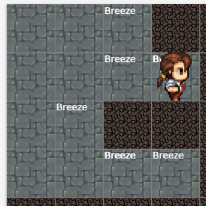

# Inferencing Propositional Logic Sentences

## AIM

To develop python code to inference propositional logic sentences to solve Wumpus World problem.

## THEORY:
The Wumpus World's agent is an example of a knowledge-based agent that represents Knowledge representation, reasoning and planning. Knowledge-Based agent links general knowledge with current percepts to infer hidden characters of current state before selecting actions.

## DESIGN STEPS
### STEP 1:
Write propositional logic sentences to define Wumpus World problem

### STEP 2:

## PROGRAM
Include your agent code here.

## OUTPUT
### Starting of game:

### Mid of game:

210012291
va66025
## RESULT

